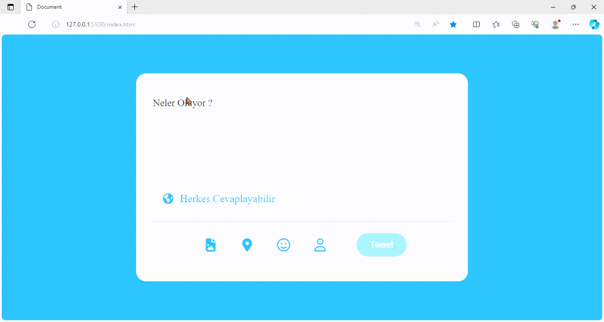

<h1>Twitter Card Proje</h1>

 Bu Proje HTML, CSS, ve JAVASCRİPT projeleri ile yapılan Twitter Card projesidir.

<h1>Kullanılan Teknolojiler</h1>

-HTML

-CSS

-JAVASCRİPT

# Javascript te Yapılacaklar Adımlar

1- Kullanıcı inputa tıkladığında place holdrın ren değiştiremes rengin değişmesi.

2- Klaveden giriş olduğunda placeholderın kabolması.

3- Klavyeden giriş yapılamıdğında placeholdrın tekrar gelmesi.

4-Eğer klavye girişi varsa tweet butonu aktif olacak.

5- Eğer kullanıcı limiti geçmişse tweet butonu pasif olacak.# TwitterCardProje

<h1>Proje Gifi</h1>

